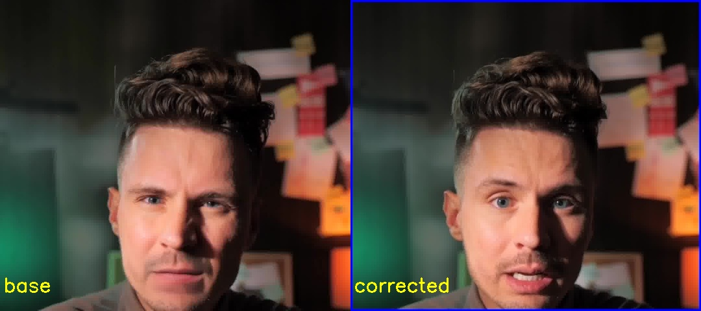

# Lip Sync Pause Correction

Image processing:
1. Read transformed video. 
2. Detect speech pause.
3. Correct speech pause (remove lip moving while no speech)

To start detection:
poetry run python main_lip_correction.py -or ./data/video/original.mp4 -tf ./data/video/transformed.mp4 -cr corrected.mp4 -ms

To see all parameters:
poetry run python main_lip_correction.py --help

Config params are saved in config.py

To launch:
1. Before starting the program, you need to install poetry if it is not installed:
curl -sSL https://install.python-poetry.org | python3 -
2. Install dependencies:
poetry install

